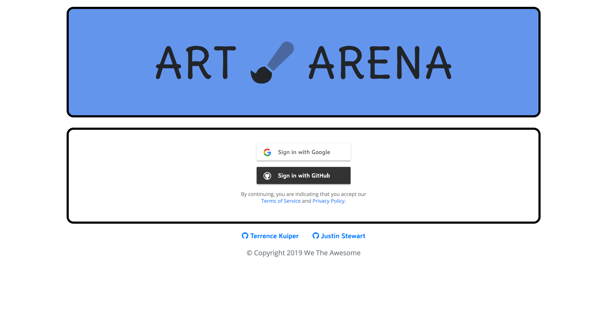
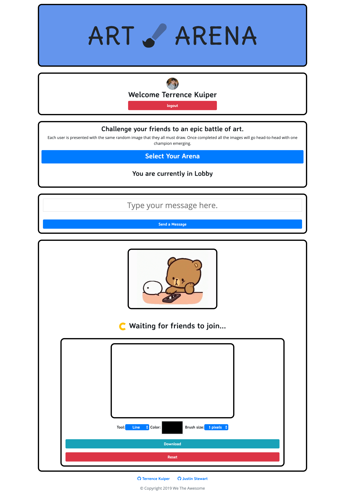

# Art Arena

## Challenge your friends to an epic battle of art.

### Each user is presented with the same random image that they all must draw. Once completed, all the images will go head-to-head with one champion emerging.

---

This project was created in 2 weeks by Terrence Kuiper & Justin Stewart as part of their final project of the 2019 Lighthouse Labs Bootcamp (Victoria, BC, CANADA)

---

Tech Stack

- "clipboard": "^2.0.4",
- "ejs": "^3.0.1",
- "express": "^4.17.1",
- "node-sass-middleware": "^0.11.0",
- "scss": "^0.2.4",
- "socket.io": "^2.3.0"
- Firebase

---

Logged Out

Logged In

